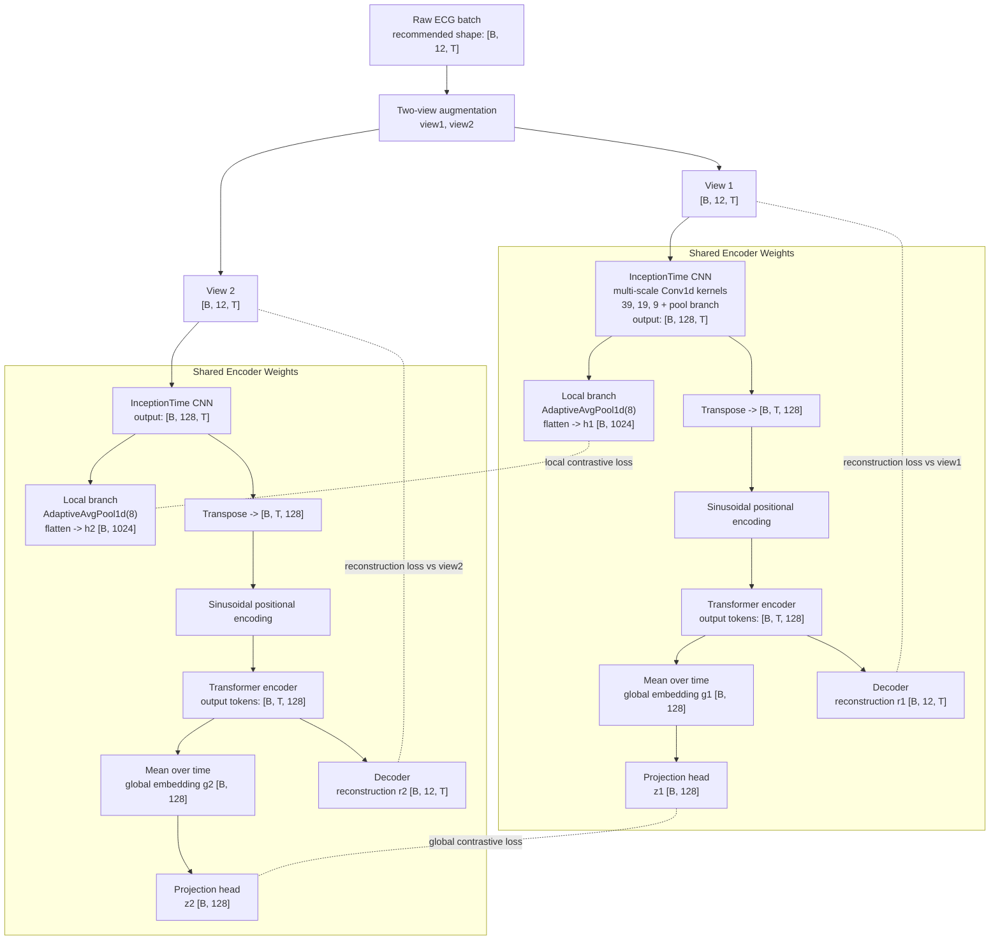

# ECG Contrastive Autoencoder Architecture

This note describes the current implementation of the ECG encoder-decoder model and the tensor shapes used throughout the forward pass.

The current training pipeline is:

- raw ECG
- augmentation into two views
- shared encoder-decoder
- local, global, and reconstruction losses

## Diagram

## Tensor Shapes

The current CNN expects tensors in PyTorch `Conv1d` format:

- `[batch, channels, length]`
- here, `channels = leads`
- here, `length = time samples`

For a 12-lead ECG recorded at 500 Hz for 10 seconds:

- sampling rate = `500 Hz`
- duration = `10 s`
- total time samples = `500 * 10 = 5000`
- number of leads = `12`

So one ECG example should typically be represented as:

- `[12, 5000]` for a single sample
- `[B, 12, 5000]` for a batch

If your data is currently stored conceptually as:

- `500 x 10 x 12`

then the first two dimensions are both parts of time, not two independent model axes. In practice, that should usually be reshaped into:

- `5000 x 12` for one ECG
- or `[B, 5000, 12]` for a batch if you prefer time-major storage before feeding the CNN

## Why The Transpose Is Needed

The transpose between the CNN and transformer exists because those two modules expect different tensor layouts.

### CNN input and output

`nn.Conv1d` expects:

- `[B, C, T]`

where:

- `B` is batch size
- `C` is channels
- `T` is sequence length

In this model, the lead dimension is treated as the channel dimension, so the CNN operates on:

- input: `[B, 12, T]`
- output: `[B, 128, T]`

That means the CNN is learning temporal filters over the ECG while mixing information across leads through the convolution weights.

### Transformer input

The transformer in this repo is created with `batch_first=True`, so it expects:

- `[B, T, D]`

where:

- `T` is the sequence length
- `D` is the per-token feature dimension

After the CNN, the tensor is `[B, 128, T]`. Here:

- `128` is the feature dimension produced by the CNN
- `T` is still the time axis

To feed this into the transformer, we swap those last two axes:

- before transpose: `[B, 128, T]`
- after transpose: `[B, T, 128]`

Now each time step becomes one token, and each token has a 128-dimensional feature vector.

## In Short

- The CNN wants `leads` in the channel position.
- The transformer wants `time` in the sequence position.
- So the CNN uses `[B, 12, T]`.
- The transformer uses `[B, T, 128]`.
- The transpose is what converts from the CNN layout to the transformer layout.

## Recommended Data Convention

To keep the code simple, the cleanest convention is:

- store raw batched ECGs as `[B, T, 12]` if that feels natural for your data pipeline
- convert to `[B, 12, T]` immediately before the CNN

If your dataset already outputs `[B, 12, T]`, then no extra transpose is needed before the CNN.
