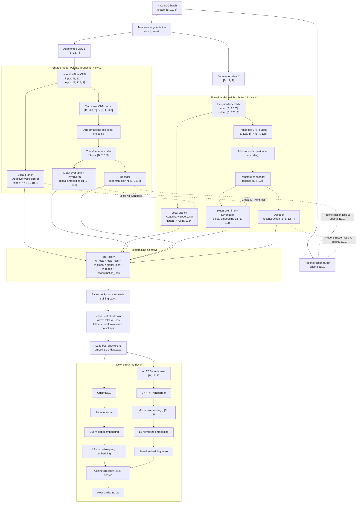

# ECG Model Workflow

This figure shows the current implementation exactly as it is used in the repository.

## Full Pipeline

## Short Reading Guide

- The CNN learns local ECG morphology from each augmented view.
- The pooled CNN features `h1` and `h2` are compared with the local contrastive loss.
- The transformer receives the CNN features after transpose and positional encoding.
- The mean-pooled transformer output `g1` and `g2` is used for the global contrastive loss.
- The decoder reconstructs the original ECG, not the augmented view.
- The best checkpoint is chosen by total validation loss.
- After training, the best checkpoint is used to create normalized global embeddings for retrieval.
- Retrieval is kNN or cosine search in that embedding space.
